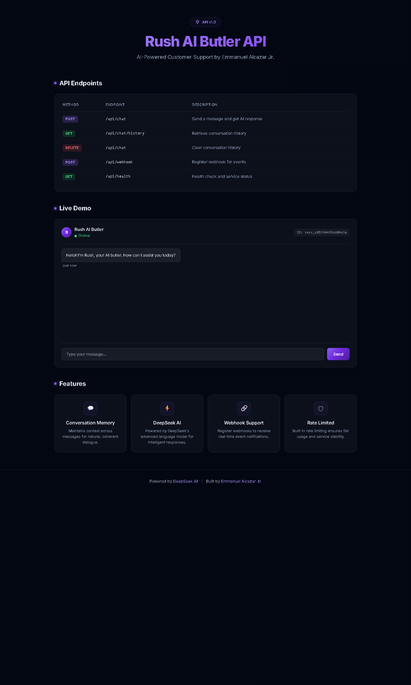
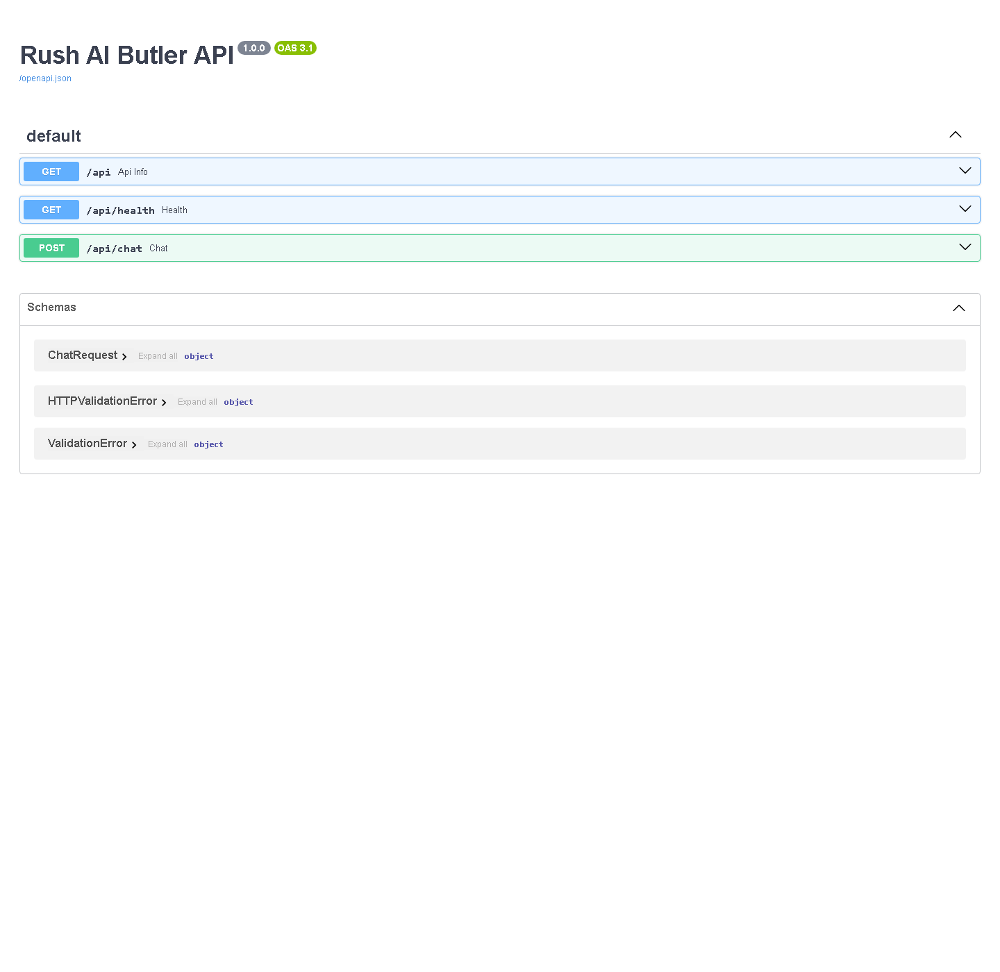

# Rush AI Butler API

An AI-powered customer support chatbot built with FastAPI and DeepSeek AI. Rush maintains conversation memory across sessions, supports webhook integrations for automation platforms (n8n, Zapier, Make, GoHighLevel), and includes rate limiting and API key authentication. The chatbot is designed to answer questions about Emmanuel's projects, skills, and experience, making it a conversational portfolio assistant.

## Screenshots

| Landing Page | API Docs (Swagger UI) |
|---|---|
|  |  |

## Tech Stack

| Component | Technology |
|-----------|------------|
| Language | Python 3.12 |
| Framework | FastAPI |
| AI Model | DeepSeek AI (deepseek-chat) |
| Database | Neon PostgreSQL (conversation history) |
| Deployment | Vercel Serverless Functions |
| Docs | Auto-generated Swagger UI |

## Features

- Conversational AI with session-based memory
- Webhook support for n8n, Zapier, Make, and GoHighLevel
- API key authentication for protected endpoints
- Rate limiting to prevent abuse
- Conversation history persistence in PostgreSQL
- Interactive Swagger documentation at `/docs`

## API Endpoints

| Method | Endpoint | Description |
|--------|----------|-------------|
| POST | `/api/chat` | Send a message to Rush |
| GET | `/api/chat/history/{session_id}` | Get conversation history |
| DELETE | `/api/chat/{session_id}` | Clear conversation |
| POST | `/api/webhook` | Receive messages from automation platforms |
| GET | `/api/health` | Health check |
| GET | `/docs` | Interactive API documentation (Swagger UI) |

### Example Request

```bash
curl -X POST https://chatbot-api-two-teal.vercel.app/api/chat \
  -H "Content-Type: application/json" \
  -H "X-API-Key: your-api-key" \
  -d '{"message": "Tell me about Emmanuel\'s projects", "session_id": "optional-session-id"}'
```

### Example Response

```json
{
  "session_id": "abc-123",
  "response": "Emmanuel has built several impressive projects including a Fraud Detection System, RAG Document Q&A API, and a Core Banking System...",
  "done": true
}
```

## Environment Variables

| Variable | Description | Required |
|----------|-------------|----------|
| `DEEPSEEK_API_KEY` | DeepSeek AI API key | Yes |
| `DATABASE_URL` | Neon PostgreSQL connection string | Yes |
| `API_KEY` | API key for authenticated endpoints | Yes |

## Local Development

```bash
# Clone the repository
git clone https://github.com/emmanalcazarjr-ops/chatbot-api.git
cd chatbot-api

# Create virtual environment
python -m venv venv
source venv/bin/activate  # Windows: venv\Scripts\activate

# Install dependencies
pip install -r requirements.txt

# Set environment variables
export DEEPSEEK_API_KEY="your-key"
export DATABASE_URL="your-neon-url"
export API_KEY="your-api-key"

# Run locally
uvicorn api.index:app --reload
```

## Live Demo

- API: https://chatbot-api-two-teal.vercel.app
- Landing Page: https://chatbot-api-two-teal.vercel.app
- Swagger Docs: https://chatbot-api-two-teal.vercel.app/docs

## Case Study

**Problem:** Emmanuel's portfolio needed an always-on conversational touchpoint that could answer visitor questions about his projects, skills, and experience — without manual response time.

**Solution:** A customer-support-style AI chatbot ("Rush") that answers portfolio questions with conversation memory, webhook automation, API key authentication, and rate limiting.

**Workflow:**
1. Visitors interact with the live chat widget or call the API directly
2. The bot maintains session memory so follow-up questions keep context
3. Messages can also arrive via webhook from automation platforms (n8n, Zapier, Make, GoHighLevel)
4. All conversations persist in PostgreSQL for history and auditing

**Tools & Technologies:** Python 3.12, FastAPI, DeepSeek AI (deepseek-chat), Neon PostgreSQL, Vercel Serverless Functions, Swagger UI

**Result:** A production-grade conversational AI assistant deployed live on Vercel, available 24/7 to any number of concurrent visitors.

**Business Impact:**
- Gives employers and clients an immediate, interactive demonstration of AI engineering skills
- Automates first-contact Q&A, reducing friction for recruiters and visitors
- Shows production-level engineering: authentication, rate limiting, persistence, webhooks, and auto-generated docs

**What I built:** The full backend API (chat, history, webhook, health endpoints), DeepSeek integration layer, PostgreSQL schema, rate limiting and auth middleware, Vercel deployment config, and the landing-page demo.

## Author

**Emmanuel L. Alcazar Jr.**
- GitHub: [@emmanalcazarjr-ops](https://github.com/emmanalcazarjr-ops)
- Portfolio: [portfolio-elalcazarjr.vercel.app](https://portfolio-elalcazarjr.vercel.app)
